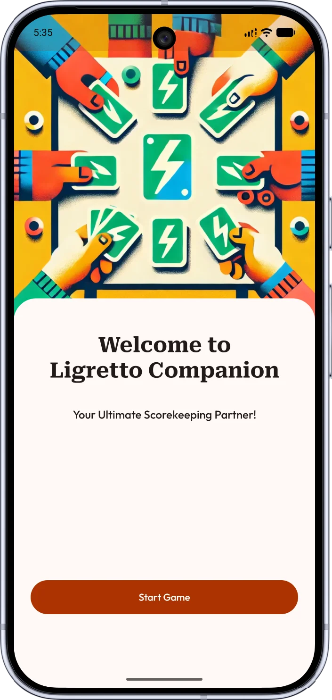
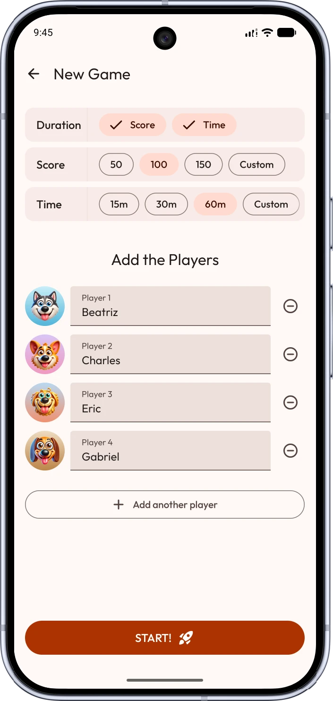
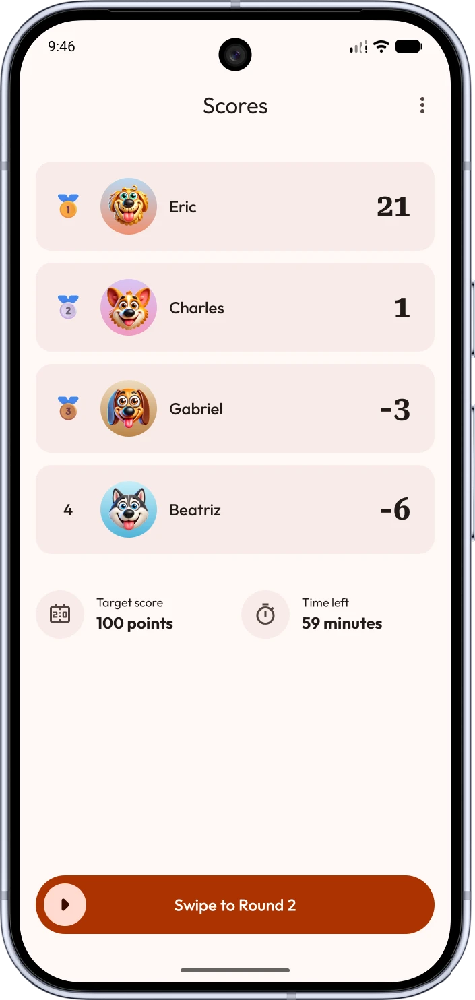

# Ligretto Companion


[](https://pinterest.github.io/ktlint/)

A Kotlin Multiplatform scorekeeper for the Ligretto card game. Track laps, scores, and players — without pen and paper.

---

<p align="center">
  
  
  
</p>

## Features

- **Game management** — Start new games, configure players, resume any interrupted session
- **Lap-by-lap scoring** — Record cards in hand and cards on the table each round; scores follow official Ligretto rules
- **Configurable win conditions** — End at a target score or after a fixed time, set before each game
- **Persistent history** — Games survive app restarts; jump back in without losing any data
- **Material You** — Dynamic color theming on Android adapts to the system palette automatically
- **One codebase, two platforms** — Shared Kotlin logic and Compose UI runs natively on Android and iOS

## Tech Stack

|                |                        |
|----------------|------------------------|
| **Language**   | Kotlin                 |
| **UI**         | Compose Multiplatform  |
| **Navigation** | Navigation 3           |
| **DI**         | Koin                   |
| **Database**   | SQLDelight             |
| **Storage**    | Multiplatform Settings |
| **Async**      | Coroutines             |
| **Logging**    | Napier                 |
| **Code style** | ktlint                 |

## Architecture

MVI + Clean Architecture across all features. The UI emits intents; the Store runs them through a pure Reducer; a new immutable `UiState` broadcasts back. Side effects (navigation, one-time events) travel on a separate `UiEffect` channel.

```
Composable  →  UiIntent  →  Store  →  Reducer  →  UiState
                                                ⊕  UiEffect
```

### Module Map

```
├── androidApp/          Platform shell — Android
├── iosApp/              Platform shell — iOS
├── commonApp/           Navigation graph + DI root
├── feature/
│   ├── home/            ui · domain
│   └── game/            ui · domain · data · model
└── core/
    ├── arch/            MVI primitives (Store, Reducer, MviViewModel)
    ├── designsystem/    Theme + tokens
    ├── database/        SQLDelight schema + platform drivers
    ├── ui/              Shared Compose components
    ├── navigation/      Navigation helpers
    └── settings/        Key-value storage abstraction
```

## Getting Started

**Prerequisites**

- Android Studio Meerkat or later
- Xcode 16+ (for the iOS target)
- JDK 17+
- Android SDK — minSdk 24, compileSdk 36

**Build & Run**

```bash
# Android debug APK
./gradlew :androidApp:assembleDebug

# Unit tests
./gradlew testDebugUnitTest

# Check code style
./gradlew ktlintCheck

# Auto-format
./gradlew ktlintFormat

# iOS — open in Xcode
open iosApp/iosApp.xcodeproj
```

## Contributing

Pull requests are welcome. For significant changes open an issue first to align on direction. Make sure `ktlintCheck` passes and all tests are green before submitting.

## License

[MIT](LICENSE)
